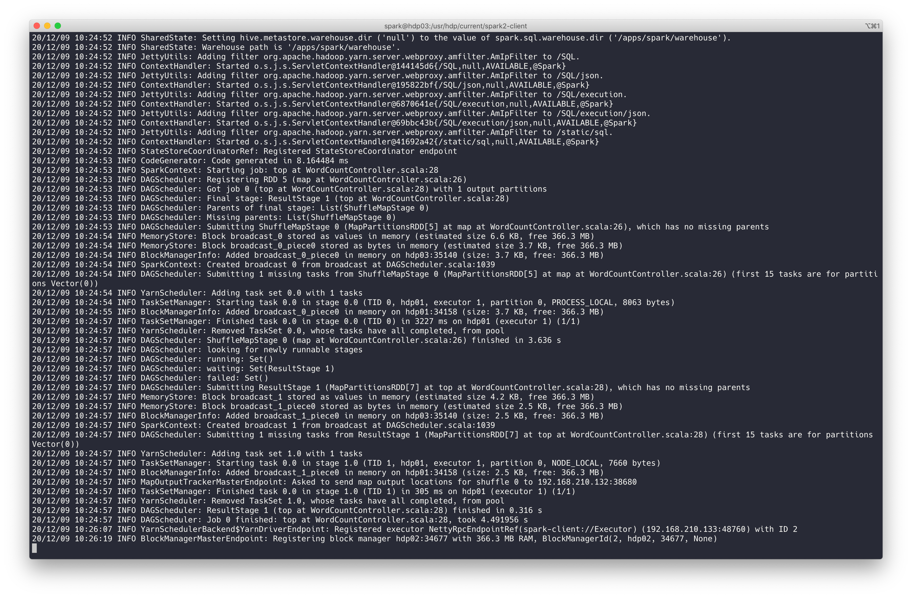
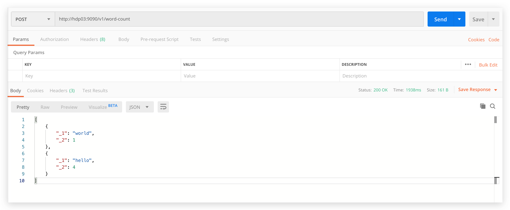

# ddpig

> Spark 与 Spring Boot 结合进行交互式 Session

## 版本

代码为 java 与 scala 混编。

- spring-boot 2.2.0.RELEASE
- spark 2.3.2

注意版本冲突，当调整版本时，需要处理依赖 jar 冲突问题。

## 本地运行

- 将 scala 和 spark 的 provide 依赖 `<scope>provided</scope>` 注释掉
- IDE 运行 Bootstrap 启动类
- POST 127.0.0.1:9090/v1/word-count 进行 word-count 计算

## Yarn

- 打包

    ```shell
    mvn clean package
    ```

- 上传 jar 到服务器

- spark-submit 提交任务

    ```shell
    ./bin/spark-submit \
     --master yarn \
     --deploy-mode client \
     --class tk.fishfish.ddpig.Bootstrap \
     --conf spark.driver.userClassPathFirst=true \
     ddpig-1.0.0-SNAPSHOT.jar
    ```

    其中: `--conf spark.driver.userClassPathFirst=true`为了防止依赖冲突，优先加载本地 jar 中的依赖
    

    
- POST YOUR_SPARK_SUBMIT_NODE_IP:9090/v1/word-count 进行 word-count 计算

    

## GIS

空间大数据方案：

- 空间数据存储在 ES 或者 HBase
- Spark 读取后利用 GeoSpark 做分析
